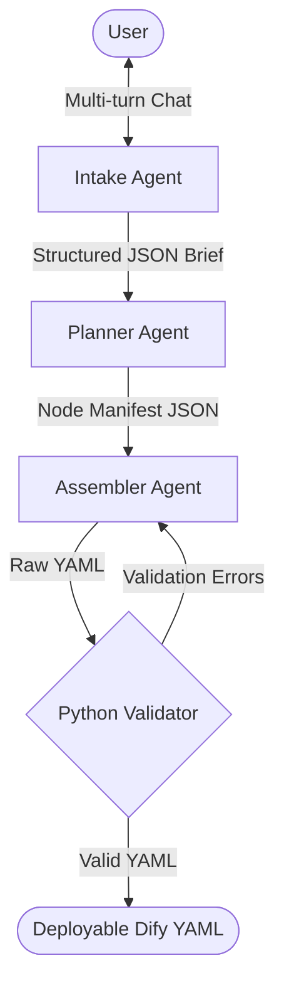

# Dify DSL Generator

Dify DSL Generator is an intelligent, multi-agent AI tool that automatically generates fully compliant [Dify](https://dify.ai/) DSL (Domain Specific Language) YAML workflows from natural language descriptions. 

It acts as your Dify Workflow architect. Simply chat with the UI to explain what kind of application you want to build (e.g., a Text Summarizer, a Customer Support Bot, a Document Q&A pipeline), and the system will orchestrate the creation of a structurally perfect, ready-to-import YAML file.

## 🚀 Features

- **Multi-Agent Architecture:** Powered by Google's Gemini models, the backend features three specialized agents:
  - **Intake Agent:** Conducts a multi-turn chat to clarify your requirements.
  - **Planner Agent:** Drafts a structural JSON plan for nodes and edges based on Dify schema rules.
  - **Assembler Agent:** Translates the blueprint into pristine, importable Dify DSL YAML.
- **Strict Validation:** A custom deterministic Python validator runs after generation to ensure structural integrity (no orphan nodes, correct variable references, strict edge definitions).
- **FastAPI Backend:** Handles all the LLM integrations, state management, and validation logic robustly.
- **Streamlit Frontend:** A sleek, interactive chat interface where you can build and view your YAML workflow live.

## 🤖 Agent Pipeline Architecture

The intelligence of the DSL Generator is broken into a 3-agent pipeline, orchestrating a flow from raw human text into structural JSON and finally into correct YAML syntax.



1. **Intake Agent (`intake.py`)** 
   - **Role:** Business Analyst
   - **Behavior:** Operates in a multi-turn chat loop with the user. It asks clarifying questions until it has enough context to build a Dify App. 
   - **Output:** Once satisfied, it outputs a `Brief` (a structured JSON object detailing the app name, mode, and conceptual nodes).
   
2. **Planner Agent (`planner.py`)**
   - **Role:** Systems Architect
   - **Behavior:** Takes the `Brief` and translates it into a strict `Node Manifest` (JSON). It resolves edge mappings, creates unique UUIDs for each node, applies mode rules (like ensuring `End` nodes for workflows vs `Answer` nodes for chatflows), and configures variable flows (like `{{#node_id.key#}}`).
   - **Output:** A JSON array of configured nodes and edges.
   
3. **Assembler Agent (`assembler.py`)**
   - **Role:** YAML Developer
   - **Behavior:** Takes the JSON `Node Manifest` and merges it with the rigid structural schemas defined in `knowledge_store.json`. It applies exact indentation, applies layout XY coordinates, and guarantees valid syntax. 
   - **Self-Healing Loop:** If the output YAML fails the deterministic python `validator.py`, the validation errors are fed *back* into the Assembler Agent, allowing it to autonomously fix its own mistakes until the YAML is perfect.
   - **Output:** The final, deployable `workflow.yaml`.

## 📁 Project Structure

```text
dslgenerator/
│
├── backend/                  # FastAPI Backend Server
│   ├── main.py               # Orchestrator & API endpoints
│   ├── validator.py          # Deterministic rules engine to validate YAML
│   └── agents/               # AI Agent Logic
│       ├── intake.py         # Handles requirement gathering chat
│       ├── planner.py        # Generates JSON manifest of nodes
│       └── assembler.py      # Outputs final YAML
│
├── frontend/                 # Streamlit UI
│   └── app.py                # Chat interface and workflow preview
│
├── knowledge/                # Dify Constraints & Schemas
│   ├── knowledge_store.json  # Definitions for all 12 supported node types
│   └── nodestemplateslayout.txt # Edge rules and visual layout logic
│
├── .env                      # Environment Variables
└── requirements.txt          # Python dependencies
```

## 🛠️ Setup & Installation

**1. Clone the repository and navigate to the project directory:**
```bash
cd dslgenerator
```

**2. Install dependencies:**
```bash
pip install -r requirements.txt
```

**3. Configure Environment Variables:**
Create or edit the `.env` file in the root directory to include your Gemini API key:
```env
GEMINI_API_KEY=your_gemini_api_key_here
MODEL=gemini-flash-latest
```

## 🏃‍♂️ Running the Application

You need to run the backend and the frontend simultaneously in two separate terminal windows.

### Start the Backend (Terminal 1)
```bash
cd backend
uvicorn main:app --reload --port 8001
```

### Start the Frontend (Terminal 2)
```bash
streamlit run frontend/app.py --server.port 8501
```

Once both are running, open your browser and navigate to `http://localhost:8501` to start generating workflows!

## 🧩 Supported Dify Nodes
The current version supports generating complete workflows combining the following nodes:
- Start / End / Answer
- LLM
- Knowledge Retrieval
- If-Else (Condition branches)
- Code (Python/JS execution)
- HTTP Request
- Template Transform
- Variable Aggregator
- Iteration
- Parameter Extractor

## 📝 How to Import into Dify
1. Build your workflow using the Streamlit chat interface.
2. Once the final valid YAML is displayed on the screen, copy it or download it.
3. Go to your Dify workspace.
4. Click **Create from DSL** and upload/paste your generated file.
5. Watch your entire node graph instantly appear!
