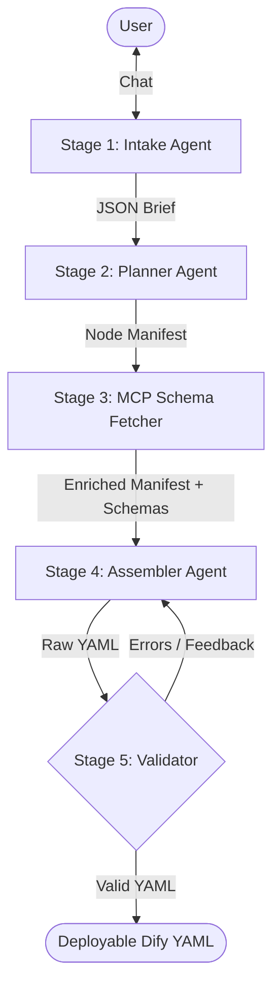

# Dify DSL Generator

Dify DSL Generator is an intelligent, multi-agent AI tool that automatically generates fully compliant [Dify](https://dify.ai/) DSL (Domain Specific Language) YAML workflows from natural language descriptions. 

It acts as your Dify Workflow architect. Simply chat with the UI to explain what kind of application you want to build (e.g., a Text Summarizer, a Customer Support Bot, a Document Q&A pipeline), and the system will orchestrate the creation of a structurally perfect, ready-to-import YAML file.

## 🚀 Features

- **LangGraph Orchestration:** The entire pipeline is managed as a stateful graph, ensuring robust data flow and agent coordination.
- **5-Stage Agent Architecture:** Powered by Google's Gemini models, the backend features specialized stages:
  - **Intake Agent:** Conducts a focused, multi-turn chat to extract your requirements.
  - **Planner Agent:** Creates a precise node manifest and variable flow map.
  - **MCP Schema Fetcher:** Acts as a Model Context Protocol layer to fetch exact Dify schemas for every node type.
  - **Assembler Agent:** Translates the blueprint into pristine, importable Dify DSL YAML.
  - **Validator Node:** A deterministic rules engine that provides feedback loops for autonomous "self-healing."
- **Sleek UI:** Interactive Streamlit interface with live pipeline tracking and YAML preview.

## 🤖 Agent Pipeline Architecture

The intelligence of the DSL Generator is broken into a 5-stage pipeline managed by LangGraph.



### The 5 Stages of Generation

1. **Intake Agent (`intake.py`)** 
   - **Role:** Business Analyst
   - **Behavior:** Collects requirements through a focused chat loop. It ensures the app mode (workflow vs chat) and primary goals are clear.
   - **Output:** A structured `Brief` JSON.

2. **Planner Agent (`planner.py`)**
   - **Role:** Systems Architect
   - **Behavior:** Translates the `Brief` into a technical `Node Manifest`. It generates UUIDs, defines node connectivity, and maps complex variable references (e.g., `{{#start.query#}}`).
   - **Output:** A structural map of the entire graph.

3. **MCP Schema Fetcher (`mcp_layer.py`)**
   - **Role:** Data Registry Specialist
   - **Behavior:** A dedicated Model Context Protocol layer that fetches the exact Dify schema for every node type identified in the plan. This prevents the LLM from hallucinating field names or configuration structures.

4. **Assembler Agent (`assembler.py`)**
   - **Role:** YAML Developer
   - **Behavior:** Takes the enriched manifest and merges it with the rigid structural schemas and layout rules. It handles XY coordinate placement and guarantees valid Dify DSL syntax.

5. **Validator Node (`validator.py`)**
   - **Role:** Quality Assurance
   - **Behavior:** Runs the generated YAML through a deterministic rules engine. If errors are found, it generates a "Fix Manifest" and loops back to the Assembler for an autonomous correction.

## 📁 Project Structure

```text
dslgenerator/
├── backend/                  # FastAPI Backend Server
│   ├── main.py               # API Orchestrator
│   ├── graph.py              # LangGraph Workflow Definition
│   ├── state.py              # Centralized AgentState Definition
│   ├── mcp_layer.py          # MCP Schema Registry Client
│   ├── validator.py          # Deterministic rules engine
│   └── agents/               # AI Agent Logic (Nodes)
│       ├── intake.py         # Requirement gathering
│       ├── planner.py        # Structural planning
│       └── assembler.py      # YAML generation
├── frontend/                 # Streamlit UI
│   └── app.py                # Chat interface and workflow preview
├── knowledge/                # Dify Constraints & Schemas
│   └── knowledge_store.json  # Data for all 12 supported node types
└── .env                      # API Keys and Model Config
```

## 🛠️ Setup & Installation

**1. Clone and navigate to the project:**
```bash
cd dslgenerator
```

**2. Install dependencies:**
```bash
pip install -r requirements.txt
```

**3. Configure Environment Variables:**
Create a `.env` file in the root:
```env
GEMINI_API_KEY=your_gemini_api_key_here
MODEL=gemini-1.5-flash
```

## 🏃‍♂️ Running the Application

### Start the Backend
```bash
cd backend
uvicorn main:app --reload --port 8001
```

### Start the Frontend
```bash
streamlit run frontend/app.py
```

Open `http://localhost:8501` to start building.

## 🧩 Supported Dify Nodes
Supports generating workflows with:
- Start / End / Answer
- LLM (Chat & Completion)
- Knowledge Retrieval
- If-Else (Logical branching)
- Code (Python3 / Javascript)
- HTTP Request
- Template Transform
- Variable Aggregator
- Iteration (Looping)
- Parameter Extractor

## 📝 How to Import into Dify
1. Build your workflow in the chat interface.
2. Once generated, download the `.yml` file.
3. In Dify, click **Create from DSL** and upload your file.
4. Your entire node graph will appear instantly!